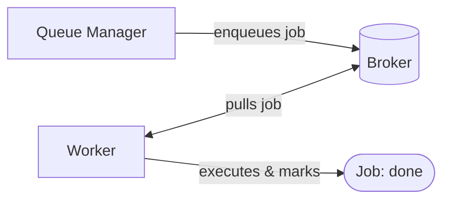
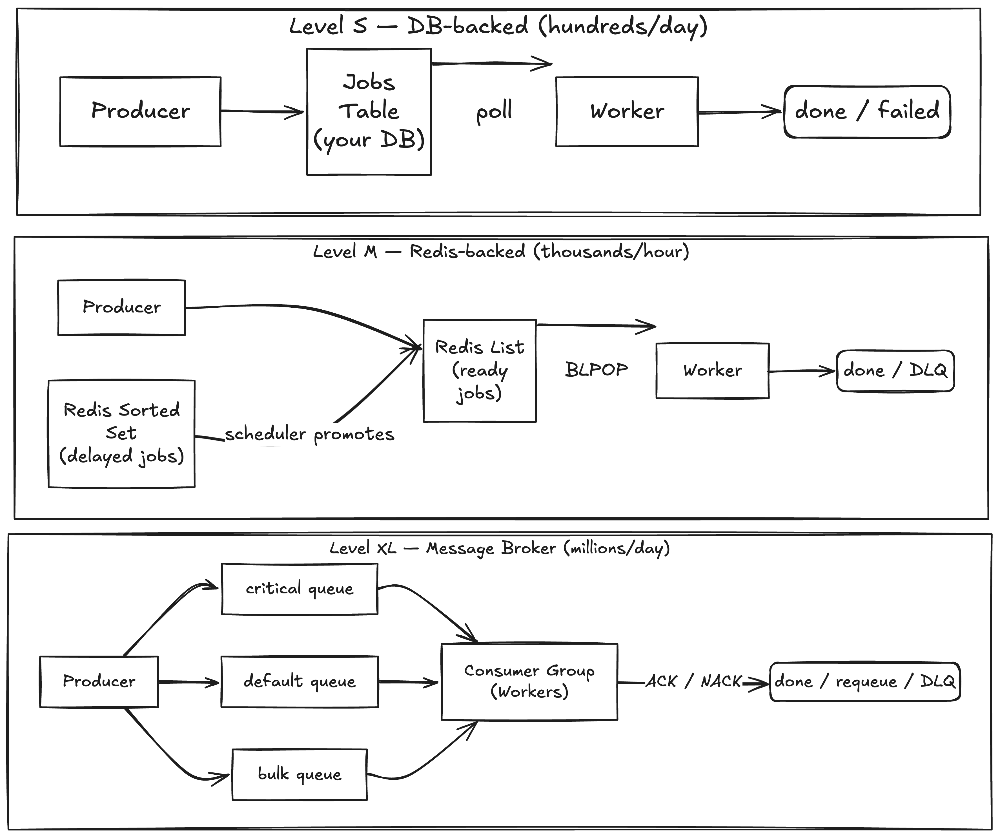

# Async Job Queue with Workers: Background Processing at Every Scale

## TL;DR

1. **Don't start with a message broker**: A jobs table in your existing DB is enough for hundreds of jobs per day and costs zero new infrastructure.

2. **The job record is the contract**:  Keep the data model identical across all tiers so you can swap the transport layer (DB → Redis → broker) without touching worker logic.

3. **Backpressure kills queues; fight it at every layer!** Rate-limit producers, cap worker concurrency, use priority lanes, monitor depth, and expire stale jobs. No single control point is sufficient.

4. **A separate process ("The sweeper") that requeues expired claims** is what makes the system resilient to worker crashes without complex distributed coordination.

5. **Exactly-once is a lie**. Design for it, assume jobs will run more than once. Idempotency keys in handlers are cheaper and more reliable than trying to guarantee exactly-once delivery at the queue level.

---

## Problem Statement

Sending emails, generating PDFs, resizing images - all work which web applications need to perform at some point in their scaling journey. Doing this inline adds latency, risks timeouts, and ties up request-handling capacity. 

Without a dedicated async system, teams resort to fire-and-forget threads or synchronous processing. Both solutions have imminent risks: they can fail silently under load and are impossible to observe or retry, opening up the question to why the failure happened and how to avoid it in the future.

## Goals

- Jobs are reliably picked up and executed
- Workers can crash and restart without losing jobs
- The system degrades gracefully under backpressure instead of dropping work
- Every job has a knowable state at any point in time, focusing on resumability if the server crashes

**Out of scope:** scheduled/cron execution, stream processing, distributed transactions

## Background & Context



The complexity lives in three places: how the broker stores and delivers jobs, how workers claim work safely, and what happens when things fail.

Good design here scales not by replacing the system but by layering on top of it. The job data model and worker contract stay the same across all three tiers. This means you can **migrate tiers without rewriting** your business logic.

## Proposed Solution

**Level S — DB-backed queue (low volume, hundreds/day)**

Use your existing database. A `jobs` table is your queue. Workers poll for unclaimed jobs using `SELECT ... FOR UPDATE SKIP LOCKED`
to prevent double-claiming. This integrates directly into any system without having to collect new know-how or 

This starts to cause issues when the polling frequency creates DB pressure and pollutes the connection. or job volume outpaces a single worker loop.

**Level M — Redis-backed queue (medium volume, thousands/hour)**

Move from polling to a push/pop model. Ready jobs live in a list (instant `BLPOP` pickup). Delayed jobs live in a sorted set, promoted to the ready list by a scheduler process. Workers no longer hammer the DB. Add a dead-letter queue as a separate list.

Breaks down at horizontal scale when consumer coordination becomes complex.

**Level XL — Dedicated message broker (high volume, millions/day)**

Introduce RabbitMQ, SQS, or equivalent. Multiple named queues with routing (critical vs. bulk vs. scheduled lanes). Workers join consumer groups. The broker handles delivery guarantees, consumer coordination, and persistence. Workers explicitly ACK or NACK — the broker decides what to requeue.



## Alternatives Considered

| Option | Pros | Cons | Why Rejected |
|--------|------|------|--------------|
| In-memory queue | Zero setup, fast | Lost on process crash, no visibility | Not durable, drops work silently on restart |
| Kafka for job queue | High throughput, replayable | Wrong semantics for background jobs, operationally heavy | Overkill; Kafka is a log, not a job queue |
| Polling-only at all scales | Simple, no broker migration | Polling at volume creates significant DB pressure | Doesn't scale beyond Level S |
| Push-only (broker pushes to workers) | Low latency | Workers get overwhelmed; harder to cap concurrency | Pull model gives workers control over their own load |

## Deep Dive: Backpressure

What do we do when the queue grows faster than workers can drain it?

Without intervention, this cascades: memory/storage fills up, job latency climbs from seconds to hours, the broker slows under its own weight, and eventually new jobs can't be enqueued at all.

**Layer 1 — Rate-limit producers**

Before a job enters the queue, enforce a per-type or per-tenant enqueue rate. This is the cheapest control — stopping work at the source costs almost nothing. Callers receive a `429` or equivalent signal, which is far better than silently queuing work you can't process. 

But this spoils the user experience of the user app. Repeatedly putting out "This request can't be completed at this time" message - looking at you, @Claude - breaks the product flow. 

**Layer 2 — Cap worker concurrency explicitly**

Workers should pull only as many jobs as they can actually run concurrently. A worker that pulls 100 jobs and processes them serially is just moving the queue into memory. Each worker declares a concurrency limit; the broker enforces it. 

We can even move this to the next level and scale workers based on demand. Check for throughput levels via obseravbility tools and scale up and also down the workers based on the demand. 

**Layer 3 — Separate queues per priority lane**

`critical`, `default`, and `bulk` queues are drained in priority order. Under load, bulk jobs wait but password reset emails do not.

This is the most optimal solution, allowing the jobs to have priority levels so that the workers know which need to be grabbed first and which can wait.

**Layer 4 — Queue depth as a first-class metric**

Depth (pending jobs) and drain rate (jobs completed/min) are the two metrics that tell you whether the system is healthy. 

Circuit-break producers when depth is critical. Surface both metrics on a dashboard — a queue that looks fine at p99 latency may already have a 10,000-job backlog.

**Layer 5 — Job TTL**

Jobs older than a defined TTL that haven't been claimed are moved to the DLQ rather than blocking the drain. This prevents old, possibly irrelevant work from starving newer jobs. TTL should be set per job type — a report generation job may tolerate hours; a notification does not.

## Data Model / API / Schema

The job record is the source of truth regardless of which tier you're on:

```
Job {
  id:               UUID
  type:             string        // "send_email", "generate_pdf", "resize_image"
  payload:          JSON          // handler-specific input
  queue:            string        // "critical" | "default" | "bulk"
  status:           enum          // pending | claimed | running | done | failed | dead
  attempts:         int           // how many times this job has been tried
  max_attempts:     int           // threshold before moving to dead-letter
  scheduled_at:     timestamp     // when the job becomes eligible (supports delay)
  claimed_at:       timestamp     // when a worker locked it (for claim TTL)
  completed_at:     timestamp     // when it finished (success or permanent failure)
  error:            string | null // last error message, for debugging
  idempotency_key:  string | null // optional: prevents duplicate side effects
}
```

Key design decisions:

- `queue` enables **priority lanes** — critical jobs never wait behind bulk jobs
- `claimed_at` enables a **sweeper process** that requeues jobs whose claim has expired — the primary recovery mechanism for worker crashes (see below)
- `idempotency_key` lets handlers declare "this job has already run" without needing the queue to guarantee exactly-once delivery.
- `dead` status means the job exceeded `max_attempts` and is parked for human inspection, not retried. Accordingly setup notifications to let the necessary people know where they need to provide a helping hand.

**The sweeper process** runs on a short interval (e.g., every 30 seconds) and scans for jobs in `claimed` or `running` status whose `claimed_at` has exceeded the claim TTL. It resets their status to `pending` and increments `attempts`. The sweeper runs as a separate, lightweight process — not co-located with workers — so a worker outage does not take it down. If multiple sweeper instances run concurrently, they must use the same locking primitive (e.g., `SELECT ... FOR UPDATE SKIP LOCKED` at Level S, a Redis lock at Level M) to avoid double-requeue.

## Failure Modes & Mitigations

| Failure | Detection | Mitigation |
|---------|-----------|------------|
| **At-least-once delivery** (job runs twice) | Duplicate side effects in downstream systems | Handlers implement idempotency using `idempotency_key`; prefer upserts over inserts |
| **Worker crash mid-job** (partial execution) | `claimed_at` age exceeds TTL | Sweeper requeues expired claims; worker emits heartbeat to extend TTL on long-running jobs |
| **Poison pill** (bad job blocks retries) | DLQ growth rate; `attempts` hitting `max_attempts` repeatedly | `max_attempts` cap moves job to `dead`; DLQ alerts notify on-call; bad jobs never block other work |
| **Queue backpressure** (drain rate < enqueue rate) | Depth metric crosses threshold | Producer rate limiting, concurrency caps, priority lanes, job TTL — see Deep Dive above |
| **Broker unavailability** | Health check failures, enqueue errors | For job types flagged `critical`, the producer falls back to synchronous in-process execution (acceptable given low volume and high importance). For all other job types, the producer writes to a local fallback buffer (e.g., an in-process queue or a DB table) and flushes to the broker automatically on recovery. The fallback is triggered by a circuit breaker on the broker client, not by operator action. |

## Rollout Plan

The system is designed to migrate tiers without rewriting worker logic. Each phase is independently deployable and observable before the next begins.

**Phase 1 — DB-backed queue**
Ship the `jobs` table, the worker poll loop, the sweeper process, and the DLQ. Validate the full job lifecycle end-to-end: enqueue → claim → execute → done/fail → retry → dead. Instrument depth and drain rate from day one. This phase proves the contract before adding broker complexity.

**Phase 2 — Redis-backed queue**
When DB polling creates measurable pressure, or job volume exceeds comfortable polling thresholds, migrate the broker. The job schema and worker interface don't change — only the enqueue and dequeue transport. Run both tiers in parallel briefly, drain the DB queue, then decommission polling.

**Phase 3 — Dedicated message broker**
When horizontal worker scaling is needed, migrate to RabbitMQ/SQS. Introduce named queue routing at this point. Workers remain largely unchanged; the broker handles coordination that Redis required manual code for.

**Rollback strategy:** each tier can fall back to the previous one because the job record is always the source of truth. Feature flags control which broker is active per job type.

**Success metrics:**
- Zero silent job drops
- DLQ growth rate < 0.1% of total enqueued
- Queue depth stays within expected bounds under peak load
- p99 job pickup latency within SLA per priority lane

## Open Questions

- What is the acceptable job pickup latency SLA per queue lane (critical vs. default vs. bulk)?
- Should `payload` be schema-validated at enqueue time, or is validation the handler's responsibility?
- Is there a need for job chaining (job A triggers job B on completion), or is that out of scope for now?
- What's the retention policy for completed/dead jobs — how long before they're purged?

## Decision Log
| Decision | Rationale |
|----------|-----------|
| Use pull model (workers pull jobs) over push model | Pull gives workers control over their own concurrency; avoids overwhelming workers under load |
| Three-tier progression over a single fixed architecture | Avoids over-engineering at low scale while providing a clear upgrade path |
| Job record as source of truth across all tiers | Enables broker migration without rewriting worker or business logic |
| Backpressure addressed at five layers | No single control point is sufficient; defense in depth prevents cascading failures |
